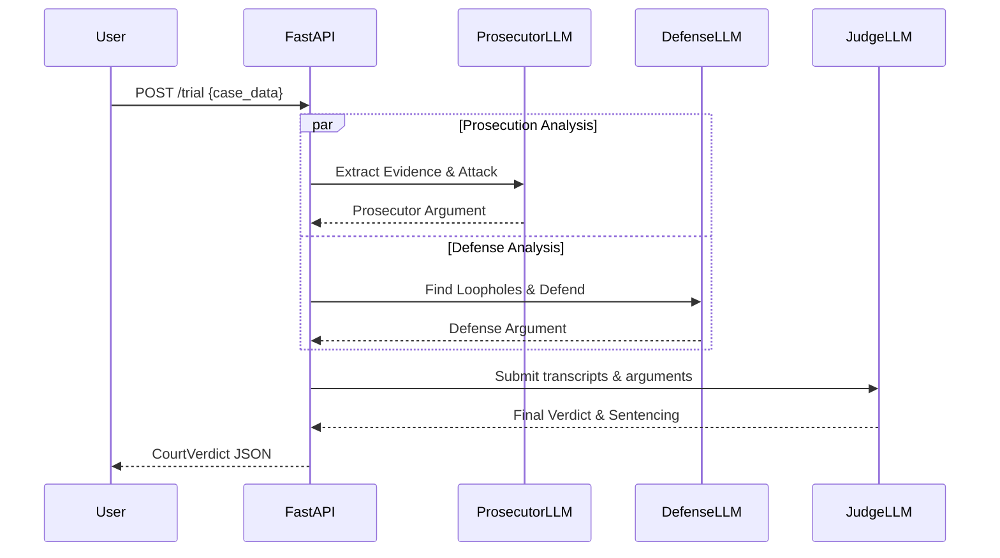

<div align="center">
  <h1>⚖️ AI Supreme Court</h1>
  <p><b>An autonomous swarm of LLM agents that act as Prosecutors, Defense Attorneys, and Judges to debate legal cases in real-time.</b></p>
  
  
  
</div>

## 📖 The Story
I was tired of watching AI just output generic text. I wanted to see reasoning, debate, and conflict. So I built a multi-agent system where LLMs take on distinct legal personas. You upload a case, and they fight it out. 

Instead of a single prompt, the system relies on **Adversarial Swarm Architecture**. The prosecution and defense run concurrently, trying to destroy each other's logic, before passing the context to the Judge.

## 🚀 How it Works
1. **The Prosecutor Agent:** Analyzes the evidence and ruthlessly constructs arguments to prove liability.
2. **The Defense Agent:** Scrutinizes the prosecutor's logic and defends the client using circumstantial loopholes.
3. **The Judge Agent:** Reviews the entire transcript, weighs the `severity_level`, and issues a final, binding verdict.

### 🧠 Swarm Architecture


## 🛠️ Quickstart

```bash
# 1. Clone the repository
git clone https://github.com/lakshanmuruganandam/ai-supreme-court.git
cd ai-supreme-court

# 2. Setup the virtual environment
python3 -m venv .venv
source .venv/bin/activate

# 3. Install dependencies
pip install -r requirements.txt

# 4. Start the courtroom
uvicorn src.main:app --reload
```

Then hit `http://127.0.0.1:8000/docs` to start your first trial using the interactive Swagger UI.

## 📦 Tech Stack
- **FastAPI:** Sub-millisecond routing and async event loops.
- **Pydantic V2:** Strict legal schema validation and typing.
- **Pytest:** Robust test coverage ensuring the courtroom rules aren't broken.

## 🤝 Contributing
Is your agent a better lawyer? Open a PR.

---
*Built with ❤️ by Lakshan Muruganandam*
